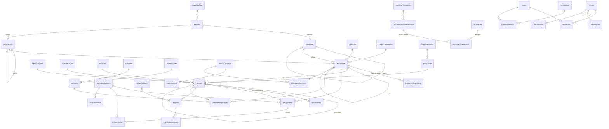

# ITAM Platform — Architecture

> Enterprise IT Asset Management Platform: учёт IT‑активов, сотрудников, выдачи/возврата/ремонта/перемещений,
> лицензий, ПО, доступов, документов и полной истории изменений.

## 1. Architecture overview

```
 Browser (React SPA, ru/en/uz)  ──HTTP(S)──►  ITAM.Server.exe  (ASP.NET Core, Windows Service)
                                               │  ├─ /api/*        REST API (JSON, DTO, validation)
                                               │  ├─ /swagger      OpenAPI documentation
                                               │  ├─ /*            SPA static files (wwwroot)
                                               │  └─ background:   notifications, scheduled backups
                                               │
                                               ├──► PostgreSQL 16 (bundled service or existing server)
                                               └──► File storage  (storage/documents, templates, attachments, backups)
```

* **Single deployable process.** `ITAM.Server.exe` is a self‑contained .NET application that hosts the REST API and the
  compiled React SPA. It runs as the Windows Service `ITAM` (also runnable as a console app / Linux / Docker).
* **Thin client.** Workstations need only a browser: `http://SERVER-IP:8080`.
* **Centralized data.** Everything lives in PostgreSQL + a file storage root; both are covered by the backup module.
* **Reverse‑proxy ready.** Forwarded headers are honoured (`X-Forwarded-For/Proto`), cookies become `Secure` under HTTPS,
  HSTS is enabled when `Security:UseHttpsRedirection=true`. Kestrel can also bind HTTPS directly with a PFX.
* **Portable.** Migrating to another server = install ITAM on the new server → *Admin → Backup → Restore* (or
  `ITAM.Server.exe restore <file>`). The backup archive contains the database dump and all stored files.

### Layers (Clean Architecture, pragmatic)

| Layer | Project | Responsibility |
|---|---|---|
| Domain | `ITAM.Domain` | Entities, enums, value objects, domain rules (temporal asset state engine, inventory number formatter, permission catalogue). No infrastructure dependencies. |
| Application | `ITAM.Application` | Use‑case services (business logic), DTOs, validation, interfaces (`IAppDbContext`, `IFileStorage`, `IDocumentRenderer`, `ICurrentUser`, `IClock`, …), audit context, region scoping. Uses EF Core LINQ abstractions only. |
| Infrastructure | `ITAM.Infrastructure` | EF Core `AppDbContext` (PostgreSQL/Npgsql), migrations, seeding, file storage (local; S3 extension point), DOCX engine (OpenXML), PDF (LibreOffice or built‑in PDFsharp renderer), XLSX (ClosedXML), QR (QRCoder), Barcode (Code128), backup (pg_dump/pg_restore), SMTP/Telegram channels, background jobs. |
| API / Host | `ITAM.Api` → `ITAM.Server.exe` | Controllers (thin), authentication (cookie sessions), authorization (permission policies), error handling middleware, rate limiting, security headers, Swagger, SPA hosting, Windows Service host, CLI (`setup`, `migrate`, `backup`, `restore`, `reset-admin`). |
| Frontend | `Frontend` | React 18 + TypeScript + Vite + Ant Design 5 + React Query + i18next + Recharts. |
| Installer | `Installer` | Inno Setup script → `ITAM-Setup.exe` (bundles app + PostgreSQL binaries). Built by GitHub Actions on `windows-latest`. |

Controllers never contain business logic: they map HTTP ⇄ DTO and call an Application service. Services throw
`BusinessException(code, message)` / `NotFoundException` / `ConflictException`; a single middleware converts them into
the unified error envelope:

```json
{ "success": false, "error": { "code": "ASSET_ALREADY_ASSIGNED", "message": "Актив уже выдан другому сотруднику", "details": null } }
```

## 2. Technology stack

| Concern | Choice | Why |
|---|---|---|
| Runtime | .NET 10 (LTS), ASP.NET Core | LTS, first‑class Windows Service support, self‑contained publish (no runtime install on the server) |
| DB | PostgreSQL 16, EF Core 10 + Npgsql | Robust, free, `jsonb`, partial unique indexes, `xmin` optimistic concurrency, `pg_dump` |
| Auth | Cookie authentication + server‑side sessions table, ASP.NET Core Identity `PasswordHasher` (PBKDF2‑HMAC‑SHA512, 100k iter.) | Revocable sessions, idle timeout, HttpOnly/SameSite cookies, no tokens in JS |
| CSRF | Antiforgery double‑submit (`XSRF-TOKEN` cookie → `X-XSRF-TOKEN` header) | Required with cookie auth |
| Logging | Serilog (console + rolling file, JSON optional) | Structured logging, sensitive data never logged |
| Docs | Swashbuckle (OpenAPI 3) at `/swagger` | API documentation |
| DOCX | DocumentFormat.OpenXml | Template placeholders `{{Employee.FullName}}`, repeating table rows |
| PDF | LibreOffice headless (if installed) → faithful conversion; fallback built‑in renderer (PDFsharp) | Works offline without extra software |
| XLSX | ClosedXML | Import/Export, reports |
| QR / Barcode | QRCoder / own Code128 SVG | Labels, public QR view |
| Frontend | React 18, TypeScript, Vite, Ant Design 5, TanStack Query, react-router, i18next, Recharts, dayjs | Enterprise UI kit with tables/filters/forms, dark/light theme, ru/en/uz locales |
| Installer | Inno Setup 6 | Reliable EXE installer, custom wizard pages, service + firewall setup |
| Tests | xUnit, WebApplicationFactory, real PostgreSQL | Unit + integration + API tests incl. concurrency |
| Optional | Docker / docker‑compose | Alternative deployment only |

## 3. Project structure

```
ITAM/
├── ITAM.sln
├── Directory.Build.props
├── Backend/
│   ├── ITAM.Domain/            Entities/, Enums/, Temporal/, Security/Permissions.cs, Numbering/
│   ├── ITAM.Application/       Common/ (interfaces, exceptions, paging, audit, scope), <Module>/ (Service + DTOs)
│   ├── ITAM.Infrastructure/    Persistence/ (DbContext, configurations, migrations, seed), Storage/, Documents/,
│   │                           Pdf/, Reports/, Backup/, Notifications/, Identity/, Jobs/
│   ├── ITAM.Api/               Controllers/, Auth/, Middleware/, Cli/, Program.cs, appsettings.json, wwwroot/ (SPA build)
│   └── Tests/
│       ├── ITAM.UnitTests/
│       └── ITAM.IntegrationTests/
├── Frontend/                   src/{api,app,components,features/*,i18n,layouts,pages,theme}
├── Installer/                  ITAM.iss, scripts/*.ps1, build-installer.ps1
├── Database/                   migrations.sql (idempotent), seed description
├── Documentation/              README / INSTALLATION / ADMIN_GUIDE / DATABASE / API / SECURITY / BACKUP / TROUBLESHOOTING / ARCHITECTURE
└── deploy/docker/              Dockerfile, docker-compose.yml (optional)
```

## 4. Database ERD (core)



Full table list and column documentation: [DATABASE.md](DATABASE.md).

## 5. Entities (by module)

* **Organization:** `Organizations`, `Regions`, `Locations` (tree; types City/Branch/Office/Building/Floor/Room/Warehouse),
  `Departments` (tree; Division/Department/Unit/Group), `Positions`.
* **Employees:** `Employees`, `EmployeeStatuses` (configurable, mapped to a system *kind*), `EmployeeOrgHistory`
  (effective‑dated department/position/region/location).
* **Assets:** `Assets`, `AssetTypes`, `AssetCategories`, `AssetStatuses` (configurable, mapped to a *state kind*),
  `Manufacturers`, `Suppliers`, `Contracts`, `CustomFieldDefinitions` (values in `jsonb`), `AssetEvents` (temporal history),
  `NumberSequences`.
* **Operations:** `OperationBatches` (act level: one issue act for N assets), `Assignments`, `AssetReturns`,
  `AssetTransfers`, `Repairs`, `RepairStatuses`, `RepairStatusHistory`.
* **Software/licensing:** `Software`, `LicenseTypes`, `Licenses` (key encrypted at rest), `LicenseAssignments`.
* **Access:** `AccessSystems`, `AccessLevels`, `EmployeeAccesses`.
* **Lifecycle workflows:** `ChecklistTemplates`, `ChecklistTemplateItems`, `EmployeeChecklists`, `EmployeeChecklistItems`.
* **Documents:** `DocumentTemplates`, `DocumentTemplateVersions`, `GeneratedDocuments`, `StoredFiles` (attachments too).
* **Inventory & stock:** `InventoryCampaigns`, `InventoryCampaignItems`, `StockItems`, `StockBalances`, `StockMovements`.
* **Security:** `Users`, `Roles`, `Permissions`, `RolePermissions`, `UserRoles`, `UserRegions`, `UserSessions`, `ApiTokens`.
* **System:** `AuditLogs` (append‑only, DB trigger forbids UPDATE/DELETE), `Notifications`, `NotificationReads`,
  `NotificationDeliveries`, `Settings`, `Backups`, `ImportJobs`.

Common columns: `Id uuid (v7)`, `OrganizationId` (multi‑tenant ready), `CreatedAt/CreatedById/UpdatedAt/UpdatedById`,
soft delete `IsDeleted/DeletedAt/DeletedById`, dictionaries have `IsArchived`, concurrency token `xmin`.

## 6. Main workflows

### Issue (выдача)
1. Operator selects employee + 1..N assets, effective date/time (may be in the past — `assets.backdate` permission),
   location, responsible person, condition, accessories, comment, document template.
2. Server, in one DB transaction: for each asset, replays its event stream with the new `Assign` event inserted at
   `EffectiveAt` (see §10). Rules: status kind must allow issue (not InRepair/Disposed/Lost/Stolen/WrittenOff/Archived),
   the asset must not be held by anyone at that moment and no *later* event may become invalid.
3. Creates `OperationBatch` (ISS‑000123) + `Assignments` (with employee/asset snapshots), `AssetEvents`, updates the
   asset projection (status/holder/location) guarded by `xmin`; a partial unique index guarantees one open assignment.
4. Audit entry `asset.assign` (old: «Склад», new: «Иванов Иван»).
5. Optional: generate the act from the selected template version (DOCX + PDF) → stored on the batch.

### Return (возврат)
Return date, condition, damage, missing items. Closes the open assignment (`EffectiveTo`), asset becomes *Available*
or *In Repair* (auto‑opens a Repair when "send to repair" is chosen). Act generation as above.

### Transfer (перемещение)
Between employees / offices / regions / warehouses / departments. Stores From/To snapshot, responsible, reason.

### Repair
Created → Sent → Diagnostics → Repairing → Waiting Parts → Completed → Returned (or Cancelled). Opening a repair moves the
asset to *In Repair* (an asset held by an employee may stay with them or be returned first — configurable per repair).
Closing restores the previous status or *Available*. Every status change is stored in `RepairStatusHistory`.

### Onboarding / Offboarding
Checklist templates (by department/position/region) instantiate a checklist for the employee. Items may be manual or
*smart* (issue asset of type X, grant access to system Y, assign software Z, return all assets, revoke all accesses…);
smart items show live completion state. Termination shows all open items (assets, licenses, accesses, open repairs,
unsigned documents) and blocks deletion — employees are archived, never physically deleted.

### Document generation
Operation → choose template → the **active version at that moment** is frozen into the generated document (version id +
data snapshot JSON + produced DOCX/PDF files). Template changes never touch existing documents.

## 7. RBAC model

* Permission catalogue is defined in code (`ITAM.Domain.Security.Permissions`) and synchronized into the `Permissions`
  table on start‑up. Roles are data (editable). Users ↔ Roles is many‑to‑many.
* Endpoints are protected with `[HasPermission("assets.assign")]` (dynamic policy provider). The SPA receives the effective
  permission list from `/api/auth/me` and hides menu items/buttons accordingly — **but every check is enforced on the backend**.
* **Regional scope:** `Users.AllRegions` or `UserRegions`. Every query over region‑bound data (employees, assets,
  locations, departments, operations, repairs, licenses with region) passes through `IRegionScope`, which adds
  `WHERE RegionId IN (...)`. Commands verify that the target object and destination are inside the scope.
* Seeded roles: Super Administrator, IT Administrator, IT Asset Manager, Helpdesk, Information Security,
  Department Manager, Auditor, Read Only (all editable except the built‑in super‑admin permissions).

Permission groups: `employees.*`, `org.*`, `assets.*` (view/create/edit/delete/assign/return/transfer/repair/status/backdate/
correct/bulk), `repairs.*`, `licenses.*`, `software.*`, `access.*`, `checklists.*`, `documents.*`
(view/generate/sign/templates.manage), `reports.view`, `import.run`, `export.run`, `audit.view`, `users.manage`,
`roles.manage`, `settings.manage`, `dictionaries.manage`, `customfields.manage`, `backup.manage`, `backup.restore`,
`notifications.view`, `inventory.*`, `stock.*`, `contracts.*`, `suppliers.*`, `system.admin`.

## 8. API structure

REST, JSON, `/api` prefix, DTOs + validation, paging `?page=1&pageSize=25&sort=name&order=asc&search=...&filters`.
Paged result: `{ items, total, page, pageSize }`. Main resources:

`/api/auth`, `/api/setup`, `/api/public`, `/api/dashboard`, `/api/search`, `/api/employees`, `/api/lookups/{key}`
(generic CRUD for all dictionaries: regions, locations, departments, positions, asset types/categories/statuses, manufacturers,
suppliers, software, license types, access systems/levels, repair statuses, stock items), `/api/assets`, `/api/operations`
(issue/return/transfer/status, acts, cancel, signatures), `/api/repairs`, `/api/licenses`, `/api/access`, `/api/checklists`,
`/api/documents`, `/api/templates`, `/api/files`, `/api/custom-fields`, `/api/reports`, `/api/import`, `/api/inventory`,
`/api/stock`, `/api/contracts`, `/api/notifications`, `/api/audit`, `/api/admin/users` (+ sessions), `/api/admin/roles`,
`/api/admin/settings`, `/api/admin/backups`, `/api/admin/system`, `/health`.

Details: [API.md](API.md) and live `/swagger`.

## 9. Document template architecture

* `DocumentTemplates` (name, document type, default flag) → `DocumentTemplateVersions` (v1, v2, …; file in storage,
  SHA‑256, detected placeholders, author, created at, `IsActive`). Uploading a new DOCX creates a new version; one version
  is active.
* Placeholders `{{Group.Field}}`: `Employee.*`, `Asset.*` (first asset), `Items` (repeating table row: a row containing
  `{{Item.X}}` is cloned for each asset), `Operation.*` / `Issue.*` / `Return.*` / `Transfer.*`, `Repair.*`,
  `Organization.*`, `Responsible.*`, `Current.Date`, custom fields `Employee.Custom.<key>` / `Asset.Custom.<key>`.
* The engine merges split Word runs before substitution, so placeholders typed in Word work even if Word fragments them.
* Generation produces DOCX (+ PDF), stores files in `storage/documents/yyyy/MM/`, writes `GeneratedDocuments` with the
  frozen template version and the full placeholder value snapshot. Signature fields (employee/responsible status, signed
  date, method, signed scan) prepare for a future electronic signature provider (`ISignatureProvider` extension point).
* Built‑in default templates (issue, return, transfer, repair, write‑off, inventory, offboarding) are generated on first run.

## 10. Historical / temporal data architecture

Every asset has an **append‑only event stream** (`AssetEvents`):

| column | meaning |
|---|---|
| `EffectiveAt` | when it really happened (business time) |
| `RecordedAt` | when it was entered (system time) |
| `RecordedById` | who entered it |
| `Sequence` | global monotonic tie‑breaker |
| `EventType` | Created, Assigned, Returned, Transferred, StatusChanged, RepairOpened, RepairClosed, Disposed, … |
| `StatusId/EmployeeId/DepartmentId/RegionId/LocationId` | asset state **after** the event (snapshot) |
| `Data` (jsonb) | human‑readable snapshot (names at that time), operation references |
| `IsCancelled` | correction marker (events are never deleted) |

**State at date T** = state of the last non‑cancelled event with `EffectiveAt <= T` (ordered by `EffectiveAt, Sequence`).

**Backdated operation algorithm** (`AssetStateEngine`, pure domain code, unit tested):
1. Load all non‑cancelled events of the asset; insert the candidate event at its `EffectiveAt`.
2. Replay from the beginning, validating each event's preconditions against the state before it (e.g. *Assign* requires
   no holder and an issuable status; *Return* requires the same holder).
3. If any event (the candidate **or any later one**) becomes invalid → reject with a precise error
   (`TEMPORAL_CONFLICT`, naming the conflicting event and date).
4. Otherwise recompute and persist the "state after" snapshot of every subsequent event and the asset projection
   (current state), all in one transaction guarded by optimistic concurrency.

Example: 01.10 issued to Ivanov, 02.10 returned, 03.10 issued to Petrov → state on 01.10 = Ivanov, 02.10 = Warehouse,
03.10 = Petrov. Inserting "issue to Sidorov on 02.10 12:00" is accepted only if it does not overlap.

Corrections: an operation can be cancelled (`assets.correct` permission, mandatory reason) → events are marked cancelled,
the stream is replayed, an audit event `operation.cancel` is written. Nothing is physically deleted.

Other temporal data:
* `Assignments.EffectiveFrom/EffectiveTo`, `LicenseAssignments.AssignedAt/RevokedAt`, `EmployeeAccesses.GrantedAt/RevokedAt`.
* `EmployeeOrgHistory` (effective‑dated department/position/region/location) → "where was the employee on date T".
* Operations store **snapshots** (names of employee, department, position, region, location at operation time), so renaming
  a department never changes historical records or documents.
* All timestamps are stored in UTC (`timestamptz`); UI renders in the organization/user timezone (default `Asia/Tashkent`).

## 11. Installer architecture

`ITAM-Setup.exe` (Inno Setup, built in CI on `windows-latest`) contains:
* `app\` — self‑contained `ITAM.Server.exe` (+ SPA in `wwwroot`), no .NET runtime required;
* `pgsql\` — PostgreSQL 16 Windows binaries (optional component).

Wizard: Windows version check (Server 2019+/Win10 1809+, x64, admin) → install directory → **Database** page (install bundled
PostgreSQL on port 5433 *or* connect to an existing server) → **PostgreSQL connection** (host/port/user/password/db) →
**Web server** (port, default 8080; organization name) → **Administrator** (login/password, validated against the password
policy) → **Options** (firewall rule, demo data). The same values can be passed for an unattended install
(`/VERYSILENT /DbPassword=… /AdminPassword=…`, see INSTALLATION.md). An upgrade (existing config found) skips the pages,
stops the service, replaces files and runs `ITAM.Server.exe migrate`. Then:
1. copy files; 2. (bundled) `initdb` + register/start service `ITAM-PostgreSQL`; 3. `ITAM.Server.exe setup ...` writes
`%ProgramData%\ITAM\config\itam.json` (folder ACL: SYSTEM + Administrators only; the application connects with its own
non‑superuser role `itam`), creates DB, runs migrations,
seeds reference data and creates the administrator; 4. registers Windows Service `ITAM` (auto start, recovery: restart);
5. `netsh advfirewall` rule for the port; 6. starts the service and shows `http://<server-ip>:<port>`.
Uninstall stops/removes services and the firewall rule; data directory is kept unless the user opts in to delete it.

If the installer is skipped (e.g. Docker), the web **Setup Wizard** (Database → Organization → Administrator → Timezone →
Initial settings → Finish) is shown on first launch.

## 12. Security architecture

* Password hashing PBKDF2 (Identity v3), password policy (length, classes, history-ready), account lockout
  (N failed attempts → M minutes), session idle timeout and absolute lifetime, server‑side session revocation.
* Cookies: `HttpOnly`, `SameSite=Strict`, `Secure` when HTTPS; antiforgery token for all state‑changing requests.
* Rate limiting: login endpoint (per IP) and global API limiter.
* Security headers: CSP, X‑Content‑Type‑Options, X‑Frame‑Options DENY, Referrer‑Policy, Permissions‑Policy, HSTS (HTTPS).
* EF Core parameterized queries only (no raw SQL concatenation); DTO validation; output encoding by React (no
  `dangerouslySetInnerHTML`); uploaded files served with `Content-Disposition: attachment` + `nosniff`, extension allow‑list.
* License keys and channel secrets (SMTP password, Telegram token) encrypted with ASP.NET Data Protection (key ring stored in
  `<data>\keys`, included in backups),
  masked in UI unless `licenses.keys.view`.
* Audit log append‑only (DB trigger), records user, IP, user agent, old/new values; sensitive fields are masked.
* Passwords, tokens and license keys are never written to logs or to the audit log (`[Sensitive]` properties are masked).
* Extension points: `IExternalAuthProvider` (LDAP/AD), OIDC (`AddOpenIdConnect`) and `IDirectorySyncService` (AD import/sync).

## 13. Development roadmap

| Phase | Scope | Status |
|---|---|---|
| 1 | Architecture, DB, auth, RBAC, regional scope, organization, employees, assets, types, issue/return, audit | ✅ implemented |
| 2 | Repairs, transfers, temporal history, backdated operations & corrections, document templates & generation | ✅ implemented |
| 3 | Licenses, software, access management, onboarding/offboarding checklists | ✅ implemented |
| 4 | Reports, dashboard, import/export, QR/barcode/labels, notifications, backup/restore, inventory campaigns, stock | ✅ implemented |
| 5 | Installer, Windows Service, hardening, documentation, tests, CI | ✅ implemented |
| Next | LDAP/AD sync, OIDC SSO, e‑signature provider, HelpDesk/ticketing, discovery agents, Intune/Graph/ESET/Wazuh connectors, GLPI/Snipe‑IT importers, Telegram bot commands, S3 storage, TOTP 2FA | extension points ready |

## 14. Extensibility map

| Future feature | Extension point |
|---|---|
| LDAP / AD auth | `IExternalAuthProvider` + `Users.AuthProvider/ExternalId` |
| AD sync (users, departments, titles, managers) | `IDirectorySyncService`, `Employees.ExternalId`, import pipeline reuse |
| SSO / OIDC | ASP.NET authentication handlers, `Authentication:Oidc` config section |
| Discovery | **implemented for Windows**: PowerShell agent → `/api/agent/*`, `AgentDevices`/`DiscoveredSoftware`, matching by serial/hostname, `AssetEvents` type `AgentInventory` (see [AGENT.md](AGENT.md)) |
| Intune / Graph / ESET / Wazuh | same intake as the agent (`AgentService.SubmitInventoryAsync`) fed by a connector |
| GLPI / Snipe‑IT import | `IImportSource` next to XLSX/CSV in the import pipeline |
| HelpDesk / Ticketing | new module referencing `Assets`/`Employees`; `AssetEvents.Data.ticket` |
| CMDB | asset relations (`ParentAssetId`) → generic `AssetRelations` table |
| Email / Telegram / Web push | `INotificationChannel` implementations |
| S3 storage | `IFileStorage` implementation selected by `Storage:Provider` |
| Power BI / SIEM | read‑only API tokens (`ApiTokens`), audit export, syslog sink for Serilog |
| Multi‑organization | `OrganizationId` on all aggregates + `ITenantContext` |
| E‑signature | `ISignatureProvider`, `GeneratedDocuments.Signature*` columns |

## 15. Additional functions (beyond the specification)

See [ADMIN_GUIDE.md → «Дополнительные функции»](ADMIN_GUIDE.md#дополнительные-функции) for the full list of 27 extra
functions with purpose, usage, tables and integration.
